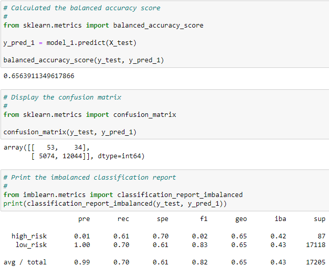

# Credit_Risk_Analysis
Supervised Machine Learning and Credit Risk

## Background Overview
In supervised machine learning, techniques may be applied to aid decision makers in situations involving two broad categories: regression and classification. As noted in the online material (Module 17.2.2), regression is applied for predicting continuous variables — such as a person's body weight, which may be "based on factors like height, dietary preferences, and exercise patterns" — whereas classification "is used to predict discrete outcomes" — for instance whether a person will vote "Yes" or "No" on a particular issue, perhaps based on "traits, such as age, (gender), income, and geographic location." In either case, the machine learning model would attempt to learn patterns from an existing dataset where the outcomes are known, then make predictions (weight, vote in the aforementioned examples) — based on those learned patterns — for new inputs.

Data analysis boss "Jill" has prepared the team to apply supervised machine learning techniques to a credit card dataset from a peer-to-peer lending-services company called "LendingClub." The dataset is to be used to train various machine-learning algorithms for making a prediction as to credit risk for loans (a *classification* supervised machine-learning application).

For the first sections of the analysis (Deliverables 1 and 2), four different Resampling Models will be used to predict the credit risk of loans; with the next section (Deliverable 3) then using two different Ensemble Classifiers for making the prediction.

## Results Summary
An analysis of all six machine learning models follows; these numbers in the table below are the dataset category numbers on which the models are based:

|\<calculation description\>|Overall Loan Count|Number Low Risk (majority class)|Number High Risk (minority class)|
|---|---|---|---|
||68817|68470|347|
|75% (default) for training|51612|51352|260|
|25% (balance) to test|17205|17118|87|

#### Resampling Models
1. **Naive Random Oversampling** 
The description that follows is from Module 17.10.1: In *random oversampling*, "instances of the minority class are randomly selected and added to the training set until the majority and minority classes are balanced." 
>[Model 1 - Scores image]

   -   Balanced accuracy score: 65.6%
   -   Precision and recall: 1%, 61%
  
2. **SMOTE Oversampling** 
From Module 17.10.1: "The *synthetic minority oversampling technique (SMOTE)* "is another oversampling approach to deal with unbalanced datasets. In SMOTE, like random oversampling, the size of the minority is increased. The key difference between the two lies in how the minority class in increased in size ... In SMOTE ... new instances are interpolated. That is, for an instance from the minority class, a number of its closest neighbors is chosen. Based on the values of these neighbors, new values are created."
>[Model 2 - Scores image]

  -   Balanced accuracy score: 67.4%
  -   Precision and recall: 1%, 64%
  
3. **Undersampling (specifically, the ClusterCentroids algorithm)** 
As noted in Module 17.10.2: "Undersampling is another technique to address class imbalance (and) takes the opposite approach of oversampling. Instead of increasing the number of the minority class, the size of the majority class is decreased. … Undersampling is practical only when there is enough data in the training set. There must be enough usable data in the undersampled majority class for a model to be useful. ... 'Cluster centroid' undersampling is akin to SMOTE. The algorithm identifies clusters of the majority class, then generates synthetic data points, called centroids, that are representative of the clusters. The majority class is then undersampled down to the size of the minority class."
>[Model 3 - Scores image]

   -   Balanced accuracy score: 56.3%
   -   Precision and recall: 1%, 64%
  
4. **Combination (Over and Under) Sampling** 
Module 17.10.3 describes the *SMOTEENN* algorithm as combining "the SMOTE and Edited Nearest Neighbors (ENN) algorithms. 'SMOTEENN' is a two-step process: 1./ Oversample the minority class with SMOTE; 2./ Clean the resulting data with an undersampling strategy. If the two nearest neighbors of a data point belong to two different classes, that data point is dropped."
>[Model 4 - Scores image]

   -   Balanced accuracy score: 65.9%
   -   Precision and recall: 1%, 67%
 
    
#### Ensemble Classifiers
1. **Balanced Random Forest Classifier** 
The Module 17 Challenge material provides the website address [ https: //imbalanced-learn.org/stable/references/generated/imblearn.ensemble.BalancedRandomForestClassifier.html ], which subsequently links to an address [ https: //imbalanced-learn.org/stable/ensemble.html#forest ] that has a description and example for this ensemble method.
>[Ensemble Model 1 - Scores]

   -   Balanced accuracy score: 75.9%
   -   Precision and recall: 3%, 63%  
  
2. **Easy Ensemble Classifier** 
Reading near the top of the page at the website link [ https:// imbalanced-learn.org/stable/references/generated/imblearn.ensemble.EasyEnsembleClassifier.html ] given in the Module 17 Challenge material, is this description: "(EasyEnsembleClassifier is a) Bag of balanced boosted learners also known as EasyEnsemble. .. The classifier is an ensemble of AdaBoost learners trained on different bootstrap samples. The balancing is achieved by random under-sampling."
>[Ensemble Model 2 - Scores]

   -   Balanced accuracy score: 92.7%
   -   Precision and recall: 7%, 92%
 
    
## Recommendations
For a model to predict credit risk satisfactorily to earn a recommendation, the top capability would ideally be to *precisely* identify a high-risk loan; *none of the six models tested calculated high-risk loans above a 7% precision* (so for about 15 loans identified high-risk, an average of only one of those would be correctly identified by that model). Relying solely on the best performing model for high-risk loan idenfication could lead to low-risk loan applicants incorrectly being denied credit, potentially leading to loss of goodwill as well as income for the LendingClub.  
As opposed to being a reason for credit denial if identified as high-risk by the (best-performing precise) model (which was the last one, the "Easy Ensemble Classifier"), the outcome could rather be used to screen an application, where further considerations would need to be individually looked at by a loan agent if flagged as "risky" by the model. This is possible since that same model successfully identifies over 90% of all risky loans by its sensitivity (recall) scoring. *Qualified use* of the model in this fashion(*), aware of its limitations as a tool, would be the most appropriate use this analysis will recommend.

(*)perhaps where additional (computer-aided) identification support is required for numerous applications.

    
#### Programming Notes
- The first four (resampling) models were trained and tested in the Jupyter Notebook "mlenv" environment.
- Due to a "cannot set attribute" error that occurred running the final two (ensemble) models, the code for those models was run in the base "Python 3 (ipykernel)" Jupyter Notebook environment with (two) further (specific version) package installations made there. (Reference commented-out "!pip install" lines in `credit_risk_ensemble.ipynb` file, and also link posted by TA J.C. in Slack "resources" on Sept. 24, to StackOverflow solution here: https:// stackoverflow.com/questions/73187115/fit-attributeerror-in-python3-using-imblearn-ensemble-and-balancedrandomfore).
